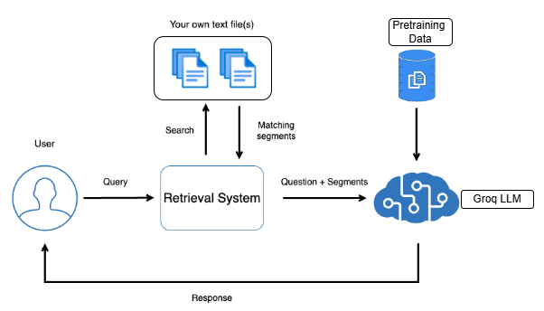

# 🤖 ExciumEdu Chat

EduMind Chat is a Streamlit-powered intelligent educational assistant that uses **Retrieval-Augmented Generation (RAG)** to answer user questions based on uploaded `.docx` documents. It leverages **LangChain**, **ChromaDB**, **HuggingFace Embeddings**, and **Groq LLMs** for fast, accurate, and contextual responses.

---

## 🚀 Features

- 🧠 **Contextual Q&A**: Understands the context of previous questions and answers.
- 🗂️ **Document-Aware**: Pulls information from uploaded Word documents.
- 🌙 **Dark/Light Theme Toggle**: Choose your preferred look and feel.
- 💬 **Chat History**: Maintains and displays the full session history.
- ✨ **User Feedback**: Collects user feedback to improve performance.

---

## 🛠️ Tech Stack

- **Frontend**: [Streamlit](https://streamlit.io/)
- **LLM**: [Groq (Gemma2-9b-it)](https://groq.com/)
- **Embeddings**: [HuggingFace Sentence Transformers](https://huggingface.co/sentence-transformers/all-mpnet-base-v2)
- **RAG Pipeline**: [LangChain](https://www.langchain.com/) + [Chroma](https://www.trychroma.com/)
- **Document Loader**: Unstructured Word Document Loader.
